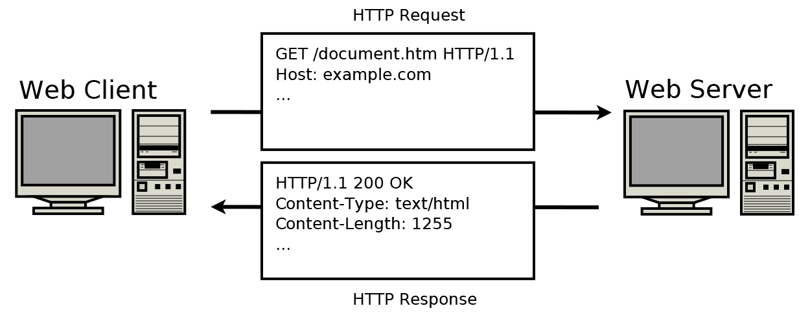
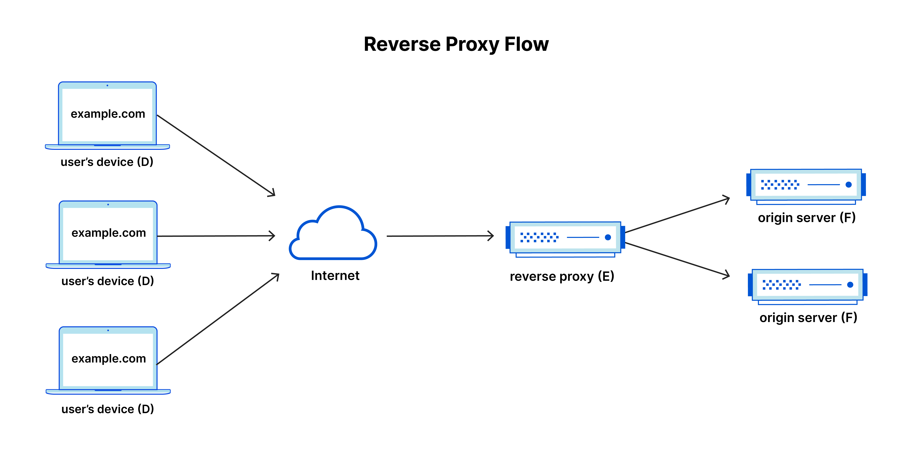

Trong bài này chúng ta sẽ tìm hiểu về nginx, nhằm trả lời cho hai câu hỏi cơ bản:

- nginx là gì?
- Cài đặt cấu hình nginx như nào?

Vì nội dung tập trung về khía cạnh kỹ thuật của nginx, nên mình sẽ lược bỏ những nội dung liên 
quan đến tác giả, cột mốc, hay lịch sử phát triển.
Bạn có thể xem những thông tin đó và cách cài đặt [ở đây](https://nginx.org/en/docs).

Lưu ý bạn nên nắm vững một số khái niệm cơ bản liên quan đến nginx trước bao gồm:

- HTTP Web Server
- Reverse Proxy
- Load Balancer
- Content Cache
- TCP/UDP Proxy Server
- Mail Proxy Server

Để thuận tiện, trong bài viết này mình cũng sẽ tóm tắt những nội dung mình nghĩ là cần thiết phải biết của 
những khái niệm đã nêu ra ở trên.

# HTTP Web Server là gì?

HTTP Web Server hay máy chủ HTTP là một phần mềm hay máy tính giao tiếp với client thông qua phương thức 
HTTP (HyperText Trasfer Protocol)/HTTPS. Cụ thể, server sẽ tiếp nhận những yêu cầu (request) từ client, sau đó xử 
lý và gửi lại phản hồi (response) trở lại client. 



*[The HTTP server](https://www.oreilly.com/library/view/hands-on-network-programming/9781789349863/c099d1ac-9bb2-46cb-9222-339617015438.xhtml)*

Để đáp ứng được những xử lý trên, HTTP Server cần có những tính năng sau đây:

- Hỗ trợ giao tiếp HTTP cơ bản

- Xử lý nội dung tĩnh và động

- Hỗ trợ bảo mật: Mã hoá dữ liệu trao đổi giữa server và client với SSL/TLS.
- Logging: ghi lại nhật ký truy cập, xử lý hay lỗi.
- v.v

# Reverse Proxy là gì?

Reverse Proxy server hay máy chủ Proxy là máy chủ trung gian giữa client và server đích. Khi client gửi yêu cầu ,
yêu cầu sẽ đi qua máy chủ proxy trước khi được chuyển tiếp đến server đích. Ở chiều ngược lại, khi server 
gửi lại phản hồi đến client cũng phải đi qua proxy server rồi mới đến client. 



*[Reverse Proxy Flow](https://www.cloudflare.com/learning/cdn/glossary/reverse-proxy/)*

Vì sao lại cần sử dụng server trung gian như proxy server? Reverse Proxy server sẽ cung cấp cho chúng ta
những tính năng như sau:

- **Bảo mật**: Ẩn thông tin của server đích, tránh những cuộc tấn công như DDoS.
- **Quản lý truy cập**: Kiểm soát, giám sát và hạn chế truy cập từ internet đến server đích.
- **Quản lý lưu lượng**: Phân bố lưu lượng đến các server khác nhau (cân bằng tải - Load Balancer)
- **Bộ nhớ đệm (Caching)**: Lưu trữ tạm các dữ liệu hay các tệp như html, css, .v.v nhằm cải thiện hiệu năng.
- v.v

# Load Balancer là gì

Load Balancer hay cân bằng tải được dùng để điều chỉnh lưu lượng truy cập (traffic) đến nhiều server (máy chủ)
khác nhau trong hệ. Điều này nhằm đảm bảo hiệu năng, tính sẵn sàng và độ tin cậy của hệ thống. Tránh trường hợp server 
nào đó bị quá tải và không thể phản hồi về client.

Ngoài ra khi sử dụng Load Balancer, chúng ta có thể dễ dàng thêm bớt số lượng trong hệ thống.

# Content Cache

Content Cache hay bộ nhớ đệm nội dung được dùng để lưu trữ tạm thời những nội dung đã được lấy từ server, nhằm tránh
việc phải tải lại những nội dung đó mỗi khi có yêu cầu. Mục tiêu của Cache nhằm tăng tốc độ truy cập, và giảm tải 
cho các server.

# TCP/UDP Proxy Server

TCP/UDP Proxy là proxy server trung gian giữa client và server đích. Server này xử lý các kết nối TCP và UDP.


# Mail Proxy Server

Mail Proxy Server là một loại proxy server dùng để quản lý và chuyển tiếp mail giữa server gửi và server nhận 
thông qua các protocol SMTP, IMAP, POP3. 

# nginx là gì?

nginx (hay engine x) là một mã nguồn mở, được sử dụng như một HTTP web server. Ngoài ra nó cũng có thể 
dùng như Reverse Proxy, Load Balancer, Content Cache, TCP/UDP Proxy Server hay Mail Proxy Server giúp tối ưu hoá 
hiệu năng của ứng dụng.

Nếu bạn nắm vững những khái niệm kể trên, thì nginx có thể hiểu đơn giản là nó sẽ thực hiện được hết những tính năng đó.

# Một số cách cài đặt cấu hình nginx cơ bản

Vì mình dùng máy mac nên những cài đặt dưới đây sẽ dựa trên môi trường của mac.

Kiểm tra tệp (file) cài đặt cấu hình:

```commandline
% sudo nginx -t
nginx: the configuration file /opt/homebrew/etc/nginx/nginx.conf syntax is ok
nginx: configuration file /opt/homebrew/etc/nginx/nginx.conf test is successful

$ sudo nano /opt/homebrew/etc/nginx/nginx.conf
```

## Cấu hình mẫu

Chúng ta sẽ tìm hiểu về cấu trúc của tệp cài đặt cấu hình qua cấu hình mẫu dưới dây. 


```properties
user nobody; # a directive in the 'main' context

# Cấu hình sự kiện
events {
    # configuration of connection processing
}

# Cấu hình HTTP
http {
    # Configuration specific to HTTP and affecting all virtual servers

    server {
        # configuration of HTTP virtual server 1
        location /one {
            # configuration for processing URIs starting with '/one'
        }
        location /two {
            # configuration for processing URIs starting with '/two'
        }
    }

    server {
        # configuration of HTTP virtual server 2
    }
}

stream {
    # Configuration specific to TCP/UDP and affecting all virtual servers
    server {
        # configuration of TCP virtual server 1
    }
}
```

nginx bao gồm nhiều modules được điều khiển bởi những directives được định nghĩa trong tệp config 
(ví dụ: /opt/homebrew/etc/nginx/nginx.conf). Những directives này được chia ra làm hai loại: simple directive 
và block directive. 

Ở trong cấu hình mẫu, `user nobody;` là một simple directive. Như thế ta có thể simple directive sẽ bao gồm tên 
`user`, biến `nobody` và dấu chấm phẩy `;` kết thúc directive. Còn với block directive, thay vì kết thúc với 
dấu chấm phẩy `;`, nó sử dụng `{}` và khai báo cài đặt ở bên trong. Ví dụ về block directive là `events {...}`.
Nếu một block directive có chứa nhiều block directive khác thì nó được gọi là `context`. `http{...}` và 
`stream {...}` là những context. Ngoài ra nếu một directive không nằm trong một block directive nào đó, nó sẽ
được coi là nằm trong `main context`.

`http {...}`, `server {...}` và `location {...}` là những core directive của nginx. 
`http {...}` được dùng để cài đặt cấu hình của HTTP server. Còn cấu hình của server ảo (virtual server) được
cài đặt ở `server {...}`. `location {}` sẽ chứa những cấu hình phụ thuộc vào URI của yêu cầu (request URI).


## Cung cấp nội dung tĩnh (static content)

Ở đây mình sẽ thử cài đặt cấu hình cho phép server có thể cung cấp những nội dung tĩnh.

Tạo file và folder:

```commandline
# Tạo folder để lưu file tĩnh như html
$ mkdir var/www
$ mkdir var/www/test

# Tạo file html
$ touch var/www/test/index.html

# Tạo folder để lưu ảnh
$ mkdir var/images

# Thêm file var/images/example.jpg
```

Lúc này ta có 2 folders có chữa những nội dung tĩnh trong ví dụ này là một file html và một file ảnh.
Tiếp theo, chúng ta sẽ thử cài đặt hai context `location {...}` như dưới đây.

```properties
http {
    server { 
      location / {
          root /var/www;
      }

      location /images/ { 
          root /var;
      }
    }
}
```

Với cấu hình cài đặt này, vì mình không cài đặt port nên mặc định server sẽ nhận thông tin từ port 80. 
Khi có yêu cầu (request) gửi đến server mà URI của nó bắt đầu với `/images/`, server 
sẽ gửi những file nằm trong thư mục `/var/images`. Ví dụ khi người dùng truy cập `http://localhost/images/example.jpg`, 
server sẽ trả tệp ảnh `var/images/example.jpg`. Với những yêu cầu có URI không bắt đầu với `/images/`, server sẽ tự động 
gửi những tệp từ thư mục `var/www`. Ví dụ khi truy cập `http://localhost/test/index.html`, server sẽ trả lại tệp 
`var/www/test/index.html`. Trong trường hợp server không thể tìm được file tương ứng, nó sẽ phản hồi lại với lỗi 404.
Trên đây là ví dụ về cách cài đặt cho phép server có thể cung cấp được những nội dung tĩnh đến client.

Để khởi động lại cấu hình, chúng ta có thể sử dụng câu lệnh dưới đây.

```commandline
$ nginx -s reload
```

## Cài đặt cấu hình Proxy

Phần này, mình sẽ tìm hiểu về cách cài đặt một proxy server đơn giản. Đầu tiên chúng ta sẽ thêm một server ảo vào
cấu hình ở ví dụ trên.

```properties
http {
    server { 
      location / {
          root /var/www;
      }

      location /images/ { 
          root /var;
      }
    }

    # Thêm cấu hình server mới 
    server {
        listen 8080;
        root /var/up1;

        location / {
        }
    }
}
```

Server được thêm mới này sẽ nhận được những yêu cầu gửi đến port 8080, và sẽ tìm những dữ liệu nằm trong thư mục `var/up1`.
Vì server chưa có thư mục này, ta có thể tạo thư mục và thêm file với những câu lệnh sau:

```commandline
$ mkdir var/up1
$ touch var/up1/index.html
```

Tiếp theo chúng ta sử dụng `proxy_pass` và chỉnh sửa `location / {...}` ở mục trước.


```properties
http {
    server { 
      location / {
          proxy_pass http://localhost:8080;
      }

      location /images/ { 
          root /var;
      }
    }

    # Thêm cấu hình server mới 
    server {
        listen 8080;
        root /var/up1;

        location / {
        }
    }
}
```

Lúc này, nếu chúng ta gửi yêu cầu (request) đến địa chỉ `http://localhost` và URI không bắt đầu với `/images/`, 
những yêu cầu này sẽ được gửi qua proxy server. 

## Cài đặt cấu hình Load Balancer

Chúng ta sẽ qua một ví dụ khác về cách cài đặt cấu hình cân bằng tải - Load Balancer. Mình có cấu hình được cài đặt
như sau:

```properties
http {
    upstream backend {
        server backend1.example.com;
        server backend2.example.com;
        server 192.0.0.1 backup;
    }

    server {
        location / {
            proxy_pass http://backend;
        }
    }
}
```

Ở đây, cầu hình này có sử dụng `proxy_pass` cho phép server chuyển tất cả những yêu cầu đến group server có tên là `backend`
(tên này thì đặt thế nào cũng được). Group này có chứa ba server là `backend1.example.com`, `backend2.example.com` và 
`192.0.0.1`. Vì cấu hình này không chỉ rõ thuật toán nào được sử dụng để dùng cho việc quản lý lưu lượng truy cập, nên 
server sẽ sử dụng thuật toán mặc định là [Round Robin](https://www.geeksforgeeks.org/load-balancing-algorithms/#11-round-robin-load-balancing-algorithms).
Có một lưu ý, tuy mình có 3 server trong group, như server `192.0.0.1` được cài đặt là backup nên nó chỉ hoạt động khi hai 
server còn lại không thể hoạt động. 

Tiếp theo chúng ta sẽ thử cài đặt thêm `weight` như sau:

```properties
http {
    upstream backend {
        server backend1.example.com weight=5;
        server backend2.example.com;
        server 192.0.0.1 backup;
    }

    server {
        location / {
            proxy_pass http://backend;
        }
    }
}
```

Lúc này cứ 6 yêu cầu được gửi đến server, thì 5 trong số đó sẽ được gửi đến `backend1.example.com` và 1 yêu cầu sẽ đến 
`backend2.example.com`. 

Trên đây là ví dụ về một cân bằng tải đơn giản. Bạn có thể xem thêm những cách cài đặt khác [ở đây](https://docs.nginx.com/nginx/admin-guide/load-balancer/).

# Tổng kết 

Trong bài này chúng ta đã tìm hiểu về những khái niệm cơ bản của ngix cùng những khái niệm liên quan khác. Ngoài ra thì 
mình cũng có thêm những ví dụ về một số cách cài đặt cấu hình đơn giản. Hy vọng nó có thể giúp ích cho chính bản thân mình,
hay ai đó đọc được bài viết này khi sử dụng nginx.

# Tài liệu tham khảo
- [Beginner’s Guide](https://nginx.org/en/docs/beginners_guide.html)
- [Creating NGINX Plus and NGINX Configuration Files](https://docs.nginx.com/nginx/admin-guide/basic-functionality/managing-configuration-files/)
- [Load Balancer](https://docs.nginx.com/nginx/admin-guide/load-balancer/)
