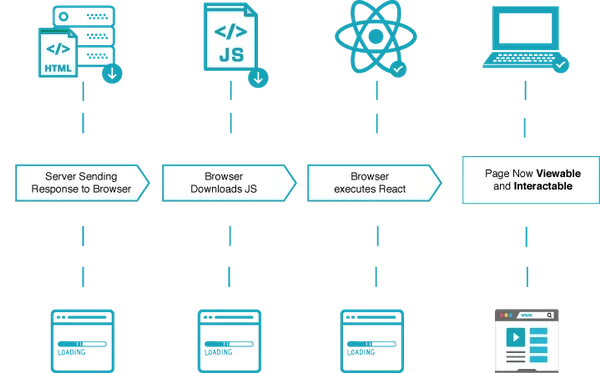
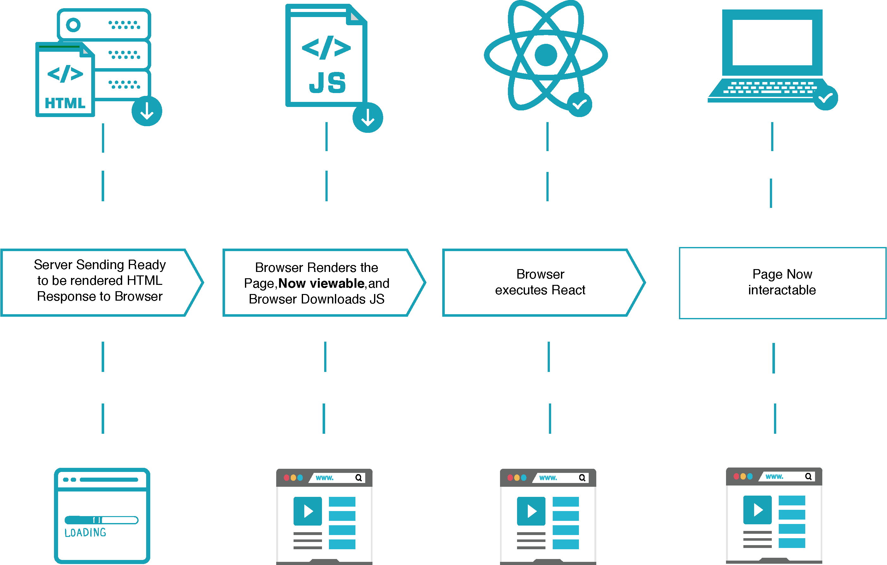

# Client Side Rendering (CSR)

Client Side Rendering (CSR) là một phương pháp mặc định trình duyệt sử dụng để hiển thị trang web. 
Đối với CSR, khi người sử dụng truy cập vào một trang web, trình duyệt
cẩn tải hết các tệp HTML và JavaScript cần thiết. Tệp JavaScript sau đó
được dùng để thay đổi DOM (Document Object Model) và hiển thị nội dung của web. 

Chúng ta có thể tham khảo quá trình hiển thị trang web theo CSR của React như hình dưới đây. Quá
trình này bao gồm các bước:

- Server gửi các tệp cần thiết như HTML, CSS, và JavaScript đến trình duyệt.
- Sau khi có tệp JavaScript, trình duyệt thực thi JavaScript code để "kết xuất" (render) ra HTML file.
- Khi code được thực thi thành công trình duyệt sẽ sử dụng nội dung đã kết xuất, lúc này người dùng có thể xem và tương tác với trang.

*Client Side Rendering ([ReactPWA](https://www.reactpwa.com/docs/en/feature-ssr.html))*

Từ những bước trên mình có thể thấy, khi hiển thị trang web với CSR, trình duyệt
cần tải toàn bộ code và thực thi trước khi có thể hiển thị nội dung. Điều này dẫn tới việc người
dùng cần đợi một khoảng thời gian cho đến khi có thể xem và tương tác với trang web đó.
Đây có thể coi là một điểm trừ về trải nghiệm của người dùng. 

Tuy nhiên sau lần tải đầu tiên, tốc độ của trang web sẽ trở nên nhanh hơn. Do lúc này, chúng ta 
chỉ cần tải thêm những dữ liệu cần thiết mà không cần tải lại toàn bộ trang. Đây lại là một ưu điểm của phương pháp CSR.

# Server Side Rendering (SSR)

Server Side Rendering (SSR) là một phương thức hiển thị trong đó phía server sẽ "kết xuất" (render) tệp HTML trước
khi gửi đến trình duyệt. Chúng ta sẽ tham khảo các bước như hình dưới đây.

- Server "kết xuất" (render) tệp HTML và gửi dến trình duyệt.
- Vì tệp HTML đã được kết xuất nên khi nhận được trình duyệt có thể hiển thị nội dung của trang web.
  (Lưu ý: trang web lúc này chưa phản hồi được với tương tác từ người dùng)
- Trình duyệt tải tệp JavaScript và thực thi.
- Sau khi JavaScript được thực thi thành công, người dùng có thể tương tác với trang web.

*Server Side Rendering ([ReactPWA](https://www.reactpwa.com/docs/en/feature-ssr.html))*

Mình có thể thấy SSR cho phép nội dung cùa trang web được hiển thị sớm hơn so với CSR. 
Điều này có thể coi là một điểm cộng về trải nghiệm người dùng.

Ngoài ra, vì nội dung HTML của trang web đã được render sẵn và gửi đến trình duyệt, nên các công cụ tìm kiếm
(search engines) có thể dễ dàng thu thập dữ liệu và đánh giá. Điều này giúp điểm SEO của trang web được cải thiện tốt hơn.

# So sánh CSR và SSR

Ở trên, chúng ta đã đề cập đến khái niệm cơ bản của CSR và SSR, phần này chúng ta sẽ thảo luận về những ưu điểm và
nhược điểm của hai phương thức kể trên. Từ đó ta có thể có những tiêu chí lựa chọn phương thức phù hợp cho ứng 
dụng của mình.

Mình sẽ so sánh hai phương thức dựa trên những yếu tố sau:

- SEO
- Trải nghiệm người dùng
- Chi phí phát triển và vận hành

## SEO

SEO (Search Engine Optimization - Tối ưu hoá công cụ tìm kiếm), là quá trình chúng ta tối ưu hoá trang web để cải thiện
thứ hạng của nó trên các công cụ tìm kiếm. Một trang web có SEO tốt, sẽ dễ dàng tiếp cận bởi người dùng hơn. Vì thế đây
cũng là một yếu tố quan trọng cần xem xét khi mình muốn xây dựng một trang web có nhiều lượng truy cập. 

Quay về hai phương thức kể trên, với CSR nội dung của trang web chỉ được hiển thị sau khi thực thi JavaScript. Trong thời gian
đợi cho JavaScript thực thi thành công, nội dung của trang sẽ trống, dẫn đến việc các công cụ tìm kiếm không thu thập đủ 
những nội dung cần thiết. Điều này làm cho SEO của trang web sẽ kém đi. Một số giải pháp là pre-rendering hoặc hydration. Tuy nhiên
nếu tệp JavaScript của bạn nhỏ thì có thể không cần quan tâm đến vấn đề này.

Trong khi đó, SSR cung cấp nội dung đã kết xuất đầy đủ cho trình duyệt, đã sẵn sàng cung cấp cho các công cụ tìm kiếm. Vì thế 
những trang web sử dụng SSR sẽ có SEO tốt hơn. 

## Trải nghiệm người dùng

Với CSR, ở lần tải đầu tiên, trình duyệt mất nhiều thời gian để hiển thị nội dung của trang web nếu tệp JavaScript lớn. 
Tuy nhiên sau khi tải xong, tốc độ của trang web sẽ trở nên nhanh hơn, khiến tương tác của người sử dụng trở nên mượt mà hơn.
Ngược lại, SSR cho phép hiển thị nội dung lần đầu tiên sớm hơn, nhưng tương tác sẽ không mượt khi so sánh với CSR. Do đó mình thấy
cũng khá khó để đánh giá phương pháp nào cung cấp trải nghiệm tốt hơn cho người dùng. Điều này có thể phụ thuộc vào nghiệp vụ, hay tính
chất của từng trang web.

Nếu trang web của mình có nhiều tương tác động, CSR có thể là lựa chọn phù hợp hơn. Nếu muốn nội dung trang web muốn hiển thị 
đến người dùng sớm hơn, mình có thể dùng SSR.

## Chi phí phát triển và vận hành

Khi dùng CSR, việc xử lý kết xuất nội dung của trang được đẩy về phía client nên không tiêu tốn nhiều tài nguyên của server. Trong khi đó
với SSR, việc xử lý đó được thực hiện phía server, vì thế chúng ta cần phải tối ưu nó. Điều này có thể dẫn đến chi phí cho phát triển và 
vận hành SSR sẽ cao hơn so với CSR.

Từ đó ta có thể thấy, nếu mình không có đủ tài nguyên phía server thì nên chọn CSR thay vì SSR. Nếu tài nguyên server không phải là vấn 
đề, bạn có thể dùng SSR.

# Tài liệu tham khảo

- [Client-side Rendering (CSR)](https://nextjs.org/docs/pages/building-your-application/rendering/client-side-rendering)
- [Are Core Web Vitals A Ranking Factor?](https://www.debugbear.com/docs/core-web-vitals-ranking-factor)

